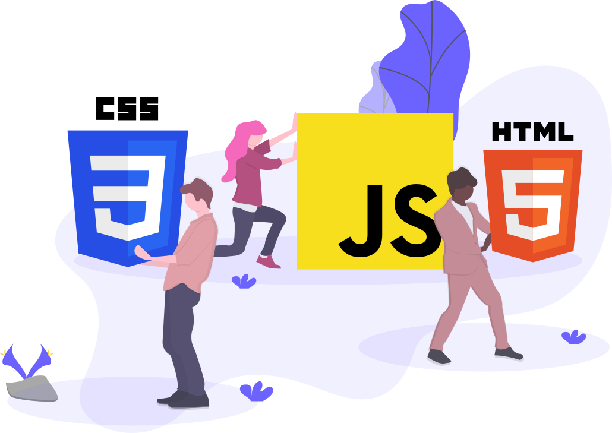

<h1 align="center">Frontend Learning Kit</h1>

Frontend tech guide and curated collection of frontend materials

  
   
  Show your support by giving a ⭐&nbsp;&nbsp;to this repo
    
  

    
    
    
    
  

<!-- 

    <h4><a href="./public/2024_FE_roadmap.pdf">Frontend Dev Roadmap & checklist</a></h4>
    <h4><a href="./public/role-guide.md">Frontend Role Guide</a> to know about different frontend roles and their criterion</h4>
    <h4><a href="./public/interview-guide.md">Frontend Interview Guide</a> to know about different frontend interview rounds</h4>
    <h4><a href="./public/frontend_projects.pdf">Frontend projects for Practice & interviews</a> (beginners to intermediates)</h4>
    <h4><a href="./public/faq.md">FAQs</a> to clarify common doubts</h4>

  <h4>Visit <a href='https://deepwiki.com/sadanandpai/frontend-learning-kit'>DeepWiki</a>, for AI interactivity on this repo</h4>

 -->

> [!IMPORTANT]
> <b>Explore our curated collection of AI resources and start your journey into AI Engineering with the [AI Learning Kit](https://github.com/sadanandpai/ai-learning-kit)</b>

 

> Become a better software engineer by working on projects that actually challenge you at [CodeCrafters](https://app.codecrafters.io/join?via=sadanandpai)

 

---

<strong>💡 How to use this guide</strong>

  
 
  
This is a curated toolkit, not a rigid curriculum. While structured in a logical sequence, feel free to jump to any topic that fits your goals. Explore resources that match your background and learning style — one may be enough, or you might need to combine several based on your objectives.

 

**Resource Types:**

> 📍 Roadmap &nbsp; 📗 Free Text/Book &nbsp; 📘 Paid Text/Book &nbsp; 🎥 Free/Paid Video/Course &nbsp; 📁 Repository &nbsp; 🚉 Practice Platform

 

## 🗺️ Roadmaps

- 📍&nbsp;&nbsp;[Road Map](https://roadmap.sh/frontend) - Comprehensive visual guide to frontend paths

 

## 🧱 HTML

- 📗&nbsp;&nbsp;[MDN HTML](https://developer.mozilla.org/en-US/docs/Web/HTML) - The authoritative reference for HTML elements and attributes
- 📗&nbsp;&nbsp;[W3 Schools](https://www.w3schools.com/html/) - Beginner-friendly, interactive HTML tutorials and examples
- 📗&nbsp;&nbsp;[HTML Tutorial](https://www.scaler.com/topics/html/) - Structured lessons on HTML fundamentals
- 🎥&nbsp;&nbsp;[Complete Guide to HTML](https://www.udemy.com/course/the-complete-guide-to-html/) - Comprehensive course covering HTML from scratch

 

## 🎨 CSS

- 📗&nbsp;&nbsp;[MDN CSS](https://developer.mozilla.org/en-US/docs/Web/CSS) - The official and exhaustive reference documentation for CSS
- 📗&nbsp;&nbsp;[Web Dev](https://web.dev/learn/css/) - An evergreen CSS course and reference by Google
- 🎥&nbsp;&nbsp;[CSS Complete Guide - Udemy](https://www.udemy.com/course/css-the-complete-guide-incl-flexbox-grid-sass/) - Top-rated course covering CSS, Flexbox, Grid, and Sass
- 📘&nbsp;&nbsp;[CSS for JS developers](https://css-for-js.dev/) - A premium course to help JS devs master CSS deeply

 

## ✨ Advanced CSS

- 📘&nbsp;&nbsp;[Debugging CSS](https://debuggingcss.com/) - Learn how to systematically diagnose and fix CSS issues
- 🎥&nbsp;&nbsp;[CSS Demystified](https://cssdemystified.com/) - A course to demystify complex CSS concepts and behaviors
- 🎥&nbsp;&nbsp;[Advanced CSS](https://www.udemy.com/course/advanced-css-and-sass/) - Deep dive into advanced CSS, Sass, Flexbox, Grid, and animations

 

## 🟡 JavaScript

- 🎥&nbsp;&nbsp;[Complete JavaScript](https://www.udemy.com/course/the-complete-javascript-course/) - One of the best-selling comprehensive JS courses
- 📗&nbsp;&nbsp;[Eloquent JavaScript](https://eloquentjavascript.net/) - A deeply respected, free online book on JavaScript programming
- 📗&nbsp;&nbsp;[JavaScript Info](https://javascript.info/) - The modern JavaScript tutorial, from basics to advanced topics
- 📗&nbsp;&nbsp;[MDN JavaScript](https://developer.mozilla.org/en-US/docs/Web/JavaScript) - The ultimate canonical reference documentation for JavaScript
- 📗&nbsp;&nbsp;[JavaScript Tutorial](https://www.javascripttutorial.net/) - Step-by-step tutorials to master modern JavaScript
- 📘&nbsp;&nbsp;[JavaScript for Impatient Programmers](https://exploringjs.com/impatient-js/toc.html) - A quick, deep guide to JS for those who already know how to code
- 📘&nbsp;&nbsp;[Just Javascript](https://justjavascript.com/) - A mental model approach to understanding JavaScript deeply by Dan Abramov

 

## 🧠 Advanced JavaScript

- 📗&nbsp;&nbsp;[You don't know JS](https://github.com/getify/You-Dont-Know-JS) - An iconic book series diving deep into core JS mechanisms
- 📗&nbsp;&nbsp;[Secrets of the JavaScript Ninja](https://www.manning.com/books/secrets-of-the-javascript-ninja-second-edition) - Advanced techniques and best practices for JS mastery
- 📘&nbsp;&nbsp;[Deep JavaScript](https://exploringjs.com/deep-js/toc.html) - Exploring advanced JS concepts and edge cases
- 📘&nbsp;&nbsp;[Professional JavaScript for Web developers](https://www.oreilly.com/library/view/professional-javascript-for/9781119366447/) - A comprehensive guide to building robust web applications
- 🎥&nbsp;&nbsp;[Deep JavaScript Foundations](https://frontendmasters.com/courses/deep-javascript-v3/) - Kyle Simpson's thorough exploration of core JS behavior
- 🎥&nbsp;&nbsp;[JavaScript Hard Parts](https://frontendmasters.com/courses/javascript-hard-parts-v3/) - Master callbacks, closures, and the event loop with Will Sentance
- 🎥&nbsp;&nbsp;[JavaScript: Understanding the Weird Parts](https://www.udemy.com/course/understand-javascript/) - Learn how JavaScript works under the hood

 

## 🔷 TypeScript

- 📗&nbsp;&nbsp;[TypeScript Deepdive](https://basarat.gitbook.io/typescript/) - A free, open-source advanced guide to TypeScript
- 📗&nbsp;&nbsp;[Tackling TypeScript](https://exploringjs.com/ts/) - A comprehensive book on upgrading from JavaScript to TypeScript
- 📗&nbsp;&nbsp;[TypeScript Tutorial](https://www.typescripttutorial.net/) - Step-by-step TS tutorials from basics to advanced
- 📗&nbsp;&nbsp;[TypeScript Handbook](https://www.typescriptlang.org/docs/handbook/intro.html) - The official starting point for learning TypeScript
- 📘&nbsp;&nbsp;[Programming TypeScript](https://www.oreilly.com/library/view/programming-typescript/9781492037644/) - O'Reilly's definitive guide to building complex apps with TS
- 🎥&nbsp;&nbsp;[Understanding TypeScript](https://www.udemy.com/course/understanding-typescript/) - A top-rated Udemy course by Maximilian Schwarzmüller
- 🎥&nbsp;&nbsp;[TypeScript Course by ui.dev](https://ui.dev/typescript/) - An interactive course to master TypeScript conceptually
- 🎥&nbsp;&nbsp;[Total TypeScript](https://www.totaltypescript.com/) - The ultimate, interactive masterclass for TypeScript by Matt Pocock

 

## ⚛️ React

- 📗&nbsp;&nbsp;[React Dev](https://react.dev/) - Official, modern documentation and interactive guides for React
- 🎥&nbsp;&nbsp;[React - The Complete Guide](https://www.udemy.com/course/react-the-complete-guide-incl-redux/) - Max's comprehensive guide covering Hooks, Redux, Next.js
- 🎥&nbsp;&nbsp;[Ultimate React](https://www.udemy.com/course/the-ultimate-react-course/) - A massive, project-based React course by Jonas Schmedtmann
- 🎥&nbsp;&nbsp;[Joy of React](https://www.joyofreact.com/) - Interactive, premium course to learn React visually by Josh W. Comeau
- 🎥&nbsp;&nbsp;[Scrimba - Learn React for free interactively](https://scrimba.com/learn/learnreact) - An excellent interactive environment for learning React basics

 

## 📁 React Repositories

- 📁&nbsp;&nbsp;[React TypeScript Cheatsheet](https://github.com/typescript-cheatsheets/react) - Essential cheatsheets for migrating and using React with TypeScript
- 📁&nbsp;&nbsp;[React code base as visual block](https://github.com/Bogdan-Lyashenko/Under-the-hood-ReactJS) - Deep dive into React's internal architecture visually
- 📁&nbsp;&nbsp;[Bulletproof React](https://github.com/alan2207/bulletproof-react) - Scalable patterns and best practices for enterprise React apps

 

## 🛠️ Frameworks & Libraries

- 🎥&nbsp;&nbsp;[NextJS](https://www.udemy.com/course/nextjs-react-the-complete-guide/) - Comprehensive course for React's most popular full-stack framework
- 🎥&nbsp;&nbsp;[Angular](https://www.udemy.com/course/the-complete-guide-to-angular-2/) - Maximilian's top-rated, complete guide to Angular
- 🎥&nbsp;&nbsp;[Vue:Complete guide](https://www.udemy.com/course/vuejs-2-the-complete-guide/) - Master Vue.js and the composition API
- 🎥&nbsp;&nbsp;[Sveltejs: Complete Guide](https://www.udemy.com/course/sveltejs-the-complete-guide/) - Build highly reactive, compiled frontend applications

 

## 🕸️ GraphQL

- 🎥&nbsp;&nbsp;[Apollo GraphQL](https://www.apollographql.com/tutorials/browse?certifications=apollo-graph-associate) - Official tutorials to master the Apollo GraphQL ecosystem
- 🎥&nbsp;&nbsp;[GraphQL Course for Beginners](https://www.youtube.com/watch?v=5199E50O7SI) - A free crash course on using GraphQL APIs

 

## 🌐 HTTP & Web Standards

- 📗&nbsp;&nbsp;[MDN HTTP](https://developer.mozilla.org/en-US/docs/Web/HTTP) - Comprehensive reference for HTTP concepts and headers
- 📘&nbsp;&nbsp;[HTTP2 in Action](https://livebook.manning.com/book/http2-in-action/about-this-book/) - Practical guide to optimizing speed using HTTP/2

 

## 🌳 Git & Version Control

- 📗&nbsp;&nbsp;[Become a git guru](https://www.atlassian.com/git/tutorials) - Atlassian's thorough tutorials on Git workflows
- 📗&nbsp;&nbsp;[Pro Git](https://git-scm.com/book/en/v2) - The official, complete reference book for everything Git
- 📁&nbsp;&nbsp;[Practical Git Guide](https://github.com/sadanandpai/git-guide) - A concise, practical cheat sheet and guide for Git

 

## ⚡ Web Performance

- 📗&nbsp;&nbsp;[MDN Performance](https://developer.mozilla.org/en-US/docs/Learn/Performance) - Mozilla's guides on measuring and improving web performance
- 📗&nbsp;&nbsp;[Web Dev Performance](https://web.dev/learn/performance) - Google's deep dive into core web vitals and fast loading
- 📗&nbsp;&nbsp;[Google Dev - Performance](https://developers.google.com/web/fundamentals/performance/get-started) - Best practices for performant web experiences
- 📗&nbsp;&nbsp;[Smashing Magazine - Performance](https://www.smashingmagazine.com/guides/performance/) - Curated articles and insights on frontline performance tuning
- 🎥&nbsp;&nbsp;[Web Performance Fundamentals](https://frontendmasters.com/courses/web-perf-v2/) - Learn how to trace, audit, and fix performance bottlenecks

 

## 🛡️ Web Security

- 🎥&nbsp;&nbsp;[Web Security](https://frontendmasters.com/courses/web-security/) - Learn to protect your web apps from common vulnerabilities
- 📗&nbsp;&nbsp;[Google Web Fundamentals: Security](https://web.dev/security/) - Guidelines for building safe and secure web properties
- 📗&nbsp;&nbsp;[MDN Web Docs: Security](https://developer.mozilla.org/en-US/docs/Web/Security) - Documentation covering web security features like CSP and CORS

 

## ♿ Accessibility

- 🎥&nbsp;&nbsp;[Accessibility in JavaScript Applications](https://frontendmasters.com/courses/javascript-accessibility/) - Interactive course dealing with modern a11y challenges
- 🎥&nbsp;&nbsp;[Develop Accessible Web Apps with React](https://egghead.io/courses/develop-accessible-web-apps-with-react) - Learn to build accessible components in React
- 🎥&nbsp;&nbsp;[Practical Accessibility](https://practical-accessibility.today/) - Fast and comprehensive course strictly focused on accessibility
- 📗&nbsp;&nbsp;[Web Accessibility Guidelines (WCAG)](https://www.w3.org/WAI/standards-guidelines/wcag/) - The official global standard for web accessibility

 

## 🧪 Frontend Testing

- 📗&nbsp;&nbsp;[Vitest](https://vitest.dev/) - A blazing fast unit test framework powered by Vite
- 📗&nbsp;&nbsp;[Jest Docs](https://jestjs.io/) - Official documentation for the popular JavaScript testing framework
- 📗&nbsp;&nbsp;[Cypress](https://www.cypress.io/) - Reliable, fast end-to-end testing for browser applications
- 🎥&nbsp;&nbsp;[JavaScript unit testing](https://www.udemy.com/course/javascript-unit-testing-the-practical-guide/) - A practical guide to testing JavaScript codebases
- 📘&nbsp;&nbsp;[The art of unit testing](https://www.manning.com/books/the-art-of-unit-testing-third-edition) - Essential principles for writing maintainable robust unit tests

 

## 📱 Progressive Web Apps (PWAs)

- 📗&nbsp;&nbsp;[MDN Guide to PWAs](https://developer.mozilla.org/en-US/docs/Web/Progressive_web_apps) - Build apps that offer native-like experiences on the web
- 📗&nbsp;&nbsp;[Google Developers: PWAs](https://web.dev/progressive-web-apps/) - Google's best practices and patterns for reliable PWAs
- 🎥&nbsp;&nbsp;[PWA - The Complete Guide](https://www.udemy.com/course/progressive-web-app-pwa-the-complete-guide/?couponCode=24T2MT111824) - Course to convert web apps to PWAs

 

## 📐 JS Design Patterns

- 📗&nbsp;&nbsp;[Modern Web App Design Patterns](https://www.patterns.dev/) - Free resource for frontend and Node.js design patterns
- 📘&nbsp;&nbsp;[JS Design Patterns](https://patterns.addy.ie/) - Addy Osmani's classic book on learning JS design patterns
- 📁&nbsp;&nbsp;[Design Patterns for Humans](https://github.com/kamranahmedse/design-patterns-for-humans) - An ultra-simplified explanation of design patterns

 

## 🧹 JS Best Practices

- 📘&nbsp;&nbsp;[Refactoring JavaScript](https://refactoringjs.com/files/refactoring-javascript.pdf) - Techniques to turn bad code into good code safely
- 🎥&nbsp;&nbsp;[Writing Clean Code](https://www.udemy.com/course/writing-clean-code/) - Principles constraints, and techniques for writing clean JavaScript
- 🎥&nbsp;&nbsp;[MicroFrontends](https://www.udemy.com/course/microfrontend-course) - Architecture guide to scaling frontend apps with Microfrontends

 

## 🔧 Functional JavaScript

- 📗&nbsp;&nbsp;[Mostly adequate Guide](https://mostly-adequate.gitbook.io/mostly-adequate-guide/) - A highly acclaimed free book on functional programming in JS
- 📗&nbsp;&nbsp;[Functional Light JavaScript](https://aguru.gitbooks.io/functional-light-javascript/content/) - Kyle Simpson's pragmatic approach to functional programming
- 🎥&nbsp;&nbsp;[Functional JavaScript](https://frontendmasters.com/courses/functional-javascript-v3/) - Learn compose, currying, and monads clearly

 

## 🏗️ Frontend System Design

- 📁&nbsp;&nbsp;[Awesome Frontend System Design](https://github.com/greatfrontend/awesome-front-end-system-design) - Curated materials and resources for frontend system design
- 📁&nbsp;&nbsp;[Frontend System Design](https://github.com/devkodeio/frontend-system-design) - A repository compiling essential concepts and examples
- 🎥&nbsp;&nbsp;[Front-End Engineer](https://www.youtube.com/c/FrontEndEngineer) - YouTube channel deeply focused on frontend architecture
- 🎥&nbsp;&nbsp;[Designing Scalable Frontend Systems](https://www.udemy.com/course/designing-scalable-frontend-systems/) - Complete guide to designing large-scale frontend solutions
- 🎥&nbsp;&nbsp;[Namaste System Design](https://namastedev.com/learn/namaste-frontend-system-design) - Detailed breakdown of frontend system design principles
- 🎥&nbsp;&nbsp;[Chakde System Design](https://www.youtube.com/watch?v=sV_4pOGosnU&list=PL4CFloQ4GGWICE0Tz6iXKfN3XWkXRlboU) - High-level frontend estimations and design
- 🎥&nbsp;&nbsp;[Frontend System Design Course](https://alpha.learnersbucket.com/course-item?item-id=66e46d5466de7fee7de65890) - Structured course by LearnersBucket for cracking design rounds
- 📗&nbsp;&nbsp;[Frontend Geek](https://www.frontendgeek.com/frontend-interview/system-design) - Collection of reading materials on system design principles

 

## 📚 Interview Prep Resources

- 📁&nbsp;&nbsp;[Front End Interview Handbook](https://github.com/yangshun/front-end-interview-handbook) - Comprehensive checklist and answers to common interview questions
- 📁&nbsp;&nbsp;[JavaScript Interview Questions](https://github.com/sudheerj/javascript-interview-questions) - 1000+ most frequently asked JS questions
- 📁&nbsp;&nbsp;[JavaScript Code Challenges](https://github.com/sadanandpai/javascript-code-challenges) - Curated set of JS algorithms and polyfills
- 📁&nbsp;&nbsp;[React Interview Questions](https://github.com/sudheerj/reactjs-interview-questions) - A massive list of React-specific interview questions
- 📁&nbsp;&nbsp;[Tech Interview Handbook](https://github.com/yangshun/tech-interview-handbook) - Generic SWE interview materials curated by an ex-Meta engineer
- 📁&nbsp;&nbsp;[JavaScript Questions MCQ](https://github.com/lydiahallie/javascript-questions) - A long list of advanced JavaScript multiple choice questions
- 📁&nbsp;&nbsp;[Frontend Mini Challenges](https://github.com/sadanandpai/frontend-mini-challenges) - Build bite-sized frontend projects to hone your UI skills
- 📁&nbsp;&nbsp;[FreeCodeCamp Interview Prep](https://github.com/freeCodeCamp/freeCodeCamp/tree/main/curriculum/challenges/english/10-coding-interview-prep) - Curated coding challenges across algorithms, JS, and more
- 📗&nbsp;&nbsp;[Interview Ant](https://www.interviewant.com/) - A collaborative, flashcard-based interview prep platform
- 📁&nbsp;&nbsp;[The DOM Challenge](https://github.com/devkodeio/the-dom-challenge) - A repository filled with practical DOM manipulation tasks
- 📁&nbsp;&nbsp;[FrontendAtlas](https://frontendatlas.com/coding) - Comprehensive roadmap and challenges for UI interviews
- 📗&nbsp;&nbsp;[JavaScript 30](https://javascript30.com/) - 30 days of building vanilla JS projects, without frameworks
- 📁&nbsp;&nbsp;[Web-Dev-For-Beginners - by Microsoft](https://github.com/microsoft/Web-Dev-For-Beginners) - A free, 12-week comprehensive web development curriculum
- 📁&nbsp;&nbsp;[React Coding Challenges](https://github.com/alexgurr/react-coding-challenges/) - Series of exercises focused on testing React knowledge

 

## 🎬 Interview Prep Channels

- 🎥&nbsp;&nbsp;[Namaste JavaScript](https://www.youtube.com/watch?v=pN6jk0uUrD8&list=PLlasXeu85E9cQ32gLCvAvr9vNaUccPVNP) - Deep dive into JS core concepts, ideal for interviews
- 🎥&nbsp;&nbsp;[Devtools Tech Frontend Interview Series](https://www.youtube.com/watch?v=qMkUziVZvzs&list=PL4ruoTJ8LTT96O258zzjRwdiNxzDoas-G&index=2) - Actual machine coding and problem-solving sessions
- 🎥&nbsp;&nbsp;[RoadsideCoder](https://www.youtube.com/@RoadsideCoder) - Excellent mock interviews and practical react coding challenges
- 🎥&nbsp;&nbsp;[JS Cafe](https://www.youtube.com/@js_cafe) - In-depth breakdown of machine coding problems and JS internals
- 🎥&nbsp;&nbsp;[Uncommon Geeks](https://www.youtube.com/watch?v=qcixpy3HQ9s&list=PLmcRO0ZwQv4QMslGJQg7N8AzaHkC5pJ4t) - Covers frontend interview topics and system design questions

 

## 📺 Frontend YouTube Channels

- 🎥&nbsp;&nbsp;[Traversy Media](https://www.youtube.com/c/TraversyMedia) - Crash courses and practical tutorials on major web technologies
- 🎥&nbsp;&nbsp;[Net Ninja](https://www.youtube.com/c/TheNetNinja) - Structured tutorial playlists for frontend frameworks
- 🎥&nbsp;&nbsp;[Web Dev Simplified](https://www.youtube.com/c/WebDevSimplified) - Complex web concepts broken down and simplified
- 🎥&nbsp;&nbsp;[Academind](https://www.youtube.com/c/Academind) - Thorough tech tutorials by Udemy favorite Max Schwarzmüller
- 🎥&nbsp;&nbsp;[Dev Ed](https://www.youtube.com/c/DevEd) - Fun, design-focused frontend tutorials and animations
- 🎥&nbsp;&nbsp;[Kevin Powell](https://www.youtube.com/kepowob) - The ultimate channel for mastering all things CSS
- 🎥&nbsp;&nbsp;[Codevolution](https://www.youtube.com/c/Codevolution) - Complete tutorial series for React, NextJS, and more
- 🎥&nbsp;&nbsp;[JavaScript Mastery](https://www.youtube.com/@javascriptmastery) - Huge project-based tutorials using modern stacks like Next.js
- 🎥&nbsp;&nbsp;[Code With Antonio](https://www.youtube.com/@codewithantonio) - Modern full-stack clone builds and massive Next.js projects
- 🎥&nbsp;&nbsp;[Clever Programmer](https://www.youtube.com/c/CleverProgrammer) - High-energy clone builds and full-stack integration projects

 

## 🏁 Coding Challenges

- 🚉&nbsp;&nbsp;[Big Frontend Dev](https://bigfrontend.dev/) - Essential platform simulating real frontend machine coding rounds
- 🚉&nbsp;&nbsp;[Great Frontend Dev](https://www.greatfrontend.com?fpr=sadanand83) - Premium platform for comprehensive frontend interview preparation
- 🚉&nbsp;&nbsp;[Leetcode](https://leetcode.com/problemset/javascript/) - The canonical home for testing core algorithm skills via JavaScript
- 🚉&nbsp;&nbsp;[Frontend Expert](https://algoexpert.io/frontend/coding-questions) - High-quality frontend and logic questions created by AlgoExpert
- 🚉&nbsp;&nbsp;[JS Challenger](https://www.jschallenger.com/) - Learn JavaScript by solving coding exercises
- 🚉&nbsp;&nbsp;[Codedamn](https://codedamn.com/problems) - Hands-on frontend and backend interactive practice environment
- 🚉&nbsp;&nbsp;[Devtools Tech](https://www.devtools.tech/?ref=frontend-learning-kit) - Highly specific frontend machine coding challenges
- 🚉&nbsp;&nbsp;[Frontend Mentor](https://www.frontendmentor.io/) - Build functional responsive sites from professional Figma designs
- 🚉&nbsp;&nbsp;[Exercism](https://exercism.org/tracks/javascript) - Mentor-guided problem solving track to master JS fundamentals
- 🚉&nbsp;&nbsp;[FrontendPro](https://www.frontendpro.dev/) - Real-world frontend coding challenges for your portfolio
- 🚉&nbsp;&nbsp;[Frontend Lead](https://frontendlead.com/) - Curated questions heavily targeting senior UI roles
- 🚉&nbsp;&nbsp;[CSS Battle](https://cssbattle.dev/) - Gamified, competitive CSS-only drawing challenges
- 🚉&nbsp;&nbsp;[Kode Karma](https://www.kodekarma.dev/) - Practical web development problem-solving exercises
- 🚉&nbsp;&nbsp;[Namaste Dev](https://namastedev.com/practice) - Practice platform to test JavaScript basics
- 🚉&nbsp;&nbsp;[Clientside Dev](https://www.clientside.dev/) - Platform specifically made to test client-side application logic
- 🚉&nbsp;&nbsp;[Frontend Churn](https://www.algochurn.com/frontend) - A curated list of frontend interview assessments
- 🚉&nbsp;&nbsp;[Reacterry](https://www.reacterry.com/) - Enhance your React skills through specialized challenges
- 🚉&nbsp;&nbsp;[Edabit](https://edabit.com/challenges) - Bite-sized JS coding challenges spanning all difficulty levels
- 🚉&nbsp;&nbsp;[Dev Challenges](https://devchallenges.io/) - Complete web developer challenges to solve
- 🚉&nbsp;&nbsp;[ICodeThis](https://icodethis.com/) - Daily practical web development challenges
- 🚉&nbsp;&nbsp;[Prepare Frontend](https://preparefrontend.com/) - Simulated frontend challenges aligned with top tech company bars
- 🚉&nbsp;&nbsp;[Ebat Dev](https://www.ebat.dev/frontend/javascript/challenges) - Designed for developers to practice real frontend interview questions

 

## 🛠️ Browser DevTools

- 📗&nbsp;&nbsp;[Chrome DevTools](https://developer.chrome.com/docs/devtools/) - Official documentation for diagnosing web pages in Chrome
- 📗&nbsp;&nbsp;[Firefox Developer Tools](https://developer.mozilla.org/en-US/docs/Tools) - Extensive tools and reference for Mozilla's Firefox browser
- 🎥&nbsp;&nbsp;[Mastering Dev Tools](https://frontendmasters.com/courses/dev-tools-v4/) - Demystifies advanced browser debugging and performance profiling
- 🛠️&nbsp;&nbsp;[Nutilz](https://nutilz.com) - Free browser-based developer utilities including regex tester, JSON formatter, diff checker, and code converters

 

## 🔢 DSA for JS Devs

- 🎥&nbsp;&nbsp;[JavaScript Algorithms fundamentals](https://pro.academind.com/p/javascript-algorithms-the-fundamentals) - Intro course to JS patterns and complexity analysis
- 🎥&nbsp;&nbsp;[Practical Algorithms](https://frontendmasters.com/courses/practical-algorithms/) - Engaging DSA course taught with JavaScript
- 🎥&nbsp;&nbsp;[JavaScript Algorithms & Data Structures](https://www.youtube.com/playlist?list=PLC3y8-rFHvwjPxNAKvZpdnsr41E0fCMMP) - Codevolution's thorough ongoing playlist for JS logic
- 🎥&nbsp;&nbsp;[JS algorithms and data structures masterclass](https://www.udemy.com/course/js-algorithms-and-data-structures-masterclass/) - Colt Steele's legendary mega-course for DSA on JS
- 🎥&nbsp;&nbsp;[The last algorithms course you'll need](https://frontendmasters.com/courses/algorithms/) - The Primeagen's incredible fast-paced DSA course using TS
- 📗&nbsp;&nbsp;[DSA Interview Challenges](https://dsa-interview-challenges.vercel.app/) - Interactive platform covering common interview DSA prompts
- 📁&nbsp;&nbsp;[Javascript Algo](https://github.com/trekhleb/javascript-algorithms) - The massive open-source library of algorithms implemented in JS

 

---

### License

This repository is MIT-licensed. [Read more](./LICENSE)
